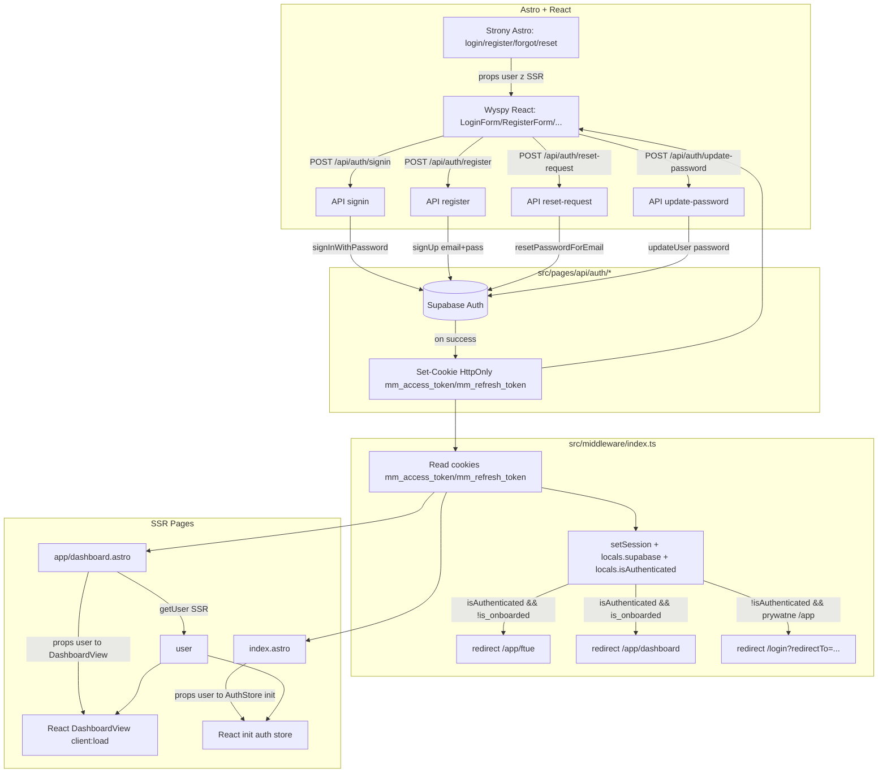

```mermaid
flowchart TD
  subgraph Client [Astro + React]
    A[Strony Astro: login/register/forgot/reset] -->|props user z SSR| B[Wyspy React: LoginForm/RegisterForm/...]
    B -->|POST /api/auth/register| AR[API register]
    B -->|POST /api/auth/signin| AL[API signin]
    B -->|POST /api/auth/reset-request| RR[API reset-request]
    B -->|POST /api/auth/update-password| UP[API update-password]
  end

  subgraph Middleware [src/middleware/index.ts]
    M1[Read cookies mm_access_token/mm_refresh_token] --> M2[setSession + locals.supabase + locals.isAuthenticated]
    M2 -->|isAuthenticated && !is_onboarded| MFTUE[redirect /app/ftue]
    M2 -->|isAuthenticated && is_onboarded| MDash[redirect /app/dashboard]
    M2 -->|!isAuthenticated && prywatne /app| MLogin[redirect /login?redirectTo=...]
  end

  subgraph API [src/pages/api/auth/*]
    AL -->|signInWithPassword| S1[(Supabase Auth)]
    AR -->|signUp email+pass| S1
    RR -->|resetPasswordForEmail| S1
    UP -->|updateUser password| S1
    S1 -->|on success| Ck[Set-Cookie HttpOnly mm_access_token/mm_refresh_token]
  end

  subgraph SSR Pages
    Dash[app/dashboard.astro] -->|getUser SSR| U[user]
    Dash -->|props user to DashboardView| DV[React DashboardView client:load]
    Index[index.astro] -->|props user to AuthStore init| AI[React init auth store]
  end

  Ck --> M1
  M1 --> Dash
  M1 --> Index
  Ck --> B
  U --> DV
  U --> AI
```
